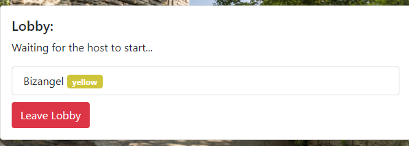
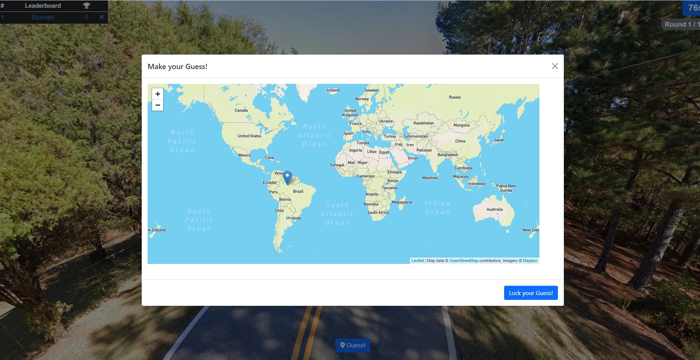
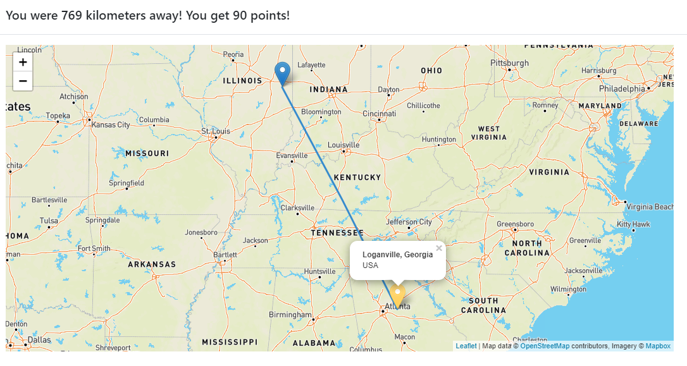

# Biza's PanoGuessr

This is a personal project game I made for me and my friends to play.

It is inspired from discountinued Google+ Panoramio game, you used to be able to play during hangout (calls).

You join the lobby and then a random panorama is fetched and the game starts.

You're given a panoramic image, which you're able to browse, and then you have to guess where in the world could this image have been taken, under a time limit.

It then finally displays the correct location of the panorama and awards points based on how close your guess was to the actual location.

This was developed with the help of a lot of libraries.

For the frontend part, I mainly used raw javascript, html and css, enhanced with bootstrap.
However for displaying the panoramas and selecting the maps I used the open source libraries of pannellum and leaflet.

As for the server-side part, I used python alongisde Flask-SocketIO (a websocket implementation) for easy, reliable, real time communication.

This project was done as an amazing learning experience, and does not intend to break any existing copyright or policies. FOR EDUCATIONAL PURPOSES ONLY.

Feel free to use this code in any way you like.

